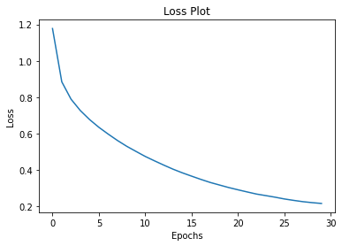
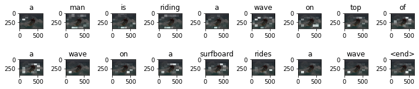

# Image Captioning

## Import Required Libraries


```python
import os
import time
import json
import random
import warnings
import collections

import numpy as np
import tensorflow as tf
import matplotlib.pyplot as plt

from PIL import Image
from progressbar import ProgressBar
from nltk.translate.bleu_score import corpus_bleu, SmoothingFunction

warnings.filterwarnings('ignore')
```

## Download and Prepare the MS-COCO Dataset


```python
# Download caption annotation files
annotation_folder = '/annotations/'
if not os.path.exists(os.path.abspath('.') + annotation_folder):
  annotation_zip = tf.keras.utils.get_file('captions.zip',
                                           cache_subdir=os.path.abspath('.'),
                                           origin='http://images.cocodataset.org/annotations/annotations_trainval2014.zip',
                                           extract=True)
  annotation_file = os.path.dirname(annotation_zip)+'/annotations/captions_train2014.json'
  os.remove(annotation_zip)
else:
  annotation_file = '/content/annotations/captions_train2014.json'
  
# Download image files
image_folder = '/train2014/'
if not os.path.exists(os.path.abspath('.') + image_folder):
  image_zip = tf.keras.utils.get_file('train2014.zip',
                                      cache_subdir=os.path.abspath('.'),
                                      origin='http://images.cocodataset.org/zips/train2014.zip',
                                      extract=True)
  PATH = os.path.dirname(image_zip) + image_folder
  os.remove(image_zip)
else:
  PATH = os.path.abspath('.') + image_folder
```

    Downloading data from http://images.cocodataset.org/annotations/annotations_trainval2014.zip
    252878848/252872794 [==============================] - 3s 0us/step
    252887040/252872794 [==============================] - 3s 0us/step
    Downloading data from http://images.cocodataset.org/zips/train2014.zip
    13510574080/13510573713 [==============================] - 287s 0us/step
    13510582272/13510573713 [==============================] - 287s 0us/step


## Optional: limit the size of the training set 


```python
with open(annotation_file, 'r') as f:
    annotations = json.load(f)
```


```python
# Group all captions together having the same image ID.
image_path_to_caption = collections.defaultdict(list)
for val in annotations['annotations']:
  caption = f"<start> {val['caption']} <end>"
  image_path = PATH + 'COCO_train2014_' + '%012d.jpg' % (val['image_id'])
  image_path_to_caption[image_path].append(caption)
```


```python
image_paths = list(image_path_to_caption.keys())
random.shuffle(image_paths)

# Select the first 6000 image_paths from the shuffled set.
# Approximately each image id has 5 captions associated with it, so that will lead to 30,000 examples.
train_image_paths = image_paths[:6000]
# train_image_paths = image_paths
print(len(train_image_paths))
```

    6000


```python
train_captions = []
img_name_vector = []

for image_path in train_image_paths:
  caption_list = image_path_to_caption[image_path]
  train_captions.extend(caption_list)
  img_name_vector.extend([image_path] * len(caption_list))
```


```python
print(train_captions[0].replace('<start> ', '').replace(' <end>', ''))
Image.open(img_name_vector[0])
```

    A baseball playing that just missed hitting the pitch


    

    


## Preprocess the Images using InceptionV3


```python
def load_image(image_path):
    img = tf.io.read_file(image_path)
    img = tf.image.decode_jpeg(img, channels=3)
    img = tf.image.resize(img, (299, 299))
    img = tf.keras.applications.inception_v3.preprocess_input(img)
    return img, image_path
```

## Initialize InceptionV3 and Load the Pretrained Imagenet Weights


```python
image_model = tf.keras.applications.InceptionV3(include_top=False, weights='imagenet')
new_input = image_model.input
hidden_layer = image_model.layers[-1].output

image_features_extract_model = tf.keras.Model(new_input, hidden_layer)
```

    Downloading data from https://storage.googleapis.com/tensorflow/keras-applications/inception_v3/inception_v3_weights_tf_dim_ordering_tf_kernels_notop.h5
    87916544/87910968 [==============================] - 1s 0us/step
    87924736/87910968 [==============================] - 1s 0us/step


## Caching the Features Extracted from InceptionV3


```python
# Get unique images
encode_train = sorted(set(img_name_vector))

# Feel free to change batch_size according to your system configuration
image_dataset = tf.data.Dataset.from_tensor_slices(encode_train)
image_dataset = image_dataset.map(
  load_image, num_parallel_calls=tf.data.AUTOTUNE).batch(16)

pbar = ProgressBar()
for img, path in pbar(image_dataset):
  batch_features = image_features_extract_model(img)
  batch_features = tf.reshape(batch_features,
                              (batch_features.shape[0], -1, batch_features.shape[3]))

  for bf, p in zip(batch_features, path):
    path_of_feature = p.numpy().decode("utf-8")
    np.save(path_of_feature, bf.numpy())
```

    100% (375 of 375) |######################| Elapsed Time: 0:01:41 Time:  0:01:41


## Preprocess and Tokenize the Captions


```python
# Find the maximum length of any caption in the dataset
def calc_max_length(tensor):
    return max(len(t) for t in tensor)
```


```python
# Choose the top 5000 words from the vocabulary
top_k = 7000
tokenizer = tf.keras.preprocessing.text.Tokenizer(num_words=top_k,
                                                  oov_token="<unk>",
                                                  filters='!"#$%&()*+.,-/:;=?@[\]^_`{|}~')
tokenizer.fit_on_texts(train_captions)
```


```python
tokenizer.word_index['<pad>'] = 0
tokenizer.index_word[0] = '<pad>'
```


```python
# Create the tokenized vectors
train_seqs = tokenizer.texts_to_sequences(train_captions)
```


```python
# Pad each vector to the max_length of the captions
cap_vector = tf.keras.preprocessing.sequence.pad_sequences(train_seqs, padding='post')
```


```python
# Calculates the max_length, which is used to store the attention weights
max_length = calc_max_length(train_seqs)
```

## Split the Data into Training and Testing


```python
img_to_cap_vector = collections.defaultdict(list)
for img, cap in zip(img_name_vector, cap_vector):
  img_to_cap_vector[img].append(cap)

# Create training and validation sets using an 80-20 split randomly.
img_keys = list(img_to_cap_vector.keys())
random.shuffle(img_keys)

slice_index = int(len(img_keys)*0.8)
img_name_train_keys, img_name_val_keys = img_keys[:slice_index], img_keys[slice_index:]

img_name_train = []
cap_train = []
for imgt in img_name_train_keys:
  capt_len = len(img_to_cap_vector[imgt])
  img_name_train.extend([imgt] * capt_len)
  cap_train.extend(img_to_cap_vector[imgt])

img_name_val = []
cap_val = []
for imgv in img_name_val_keys:
  capv_len = len(img_to_cap_vector[imgv])
  img_name_val.extend([imgv] * capv_len)
  cap_val.extend(img_to_cap_vector[imgv])
```


```python
len(img_name_train), len(cap_train), len(img_name_val), len(cap_val)
```


    (24012, 24012, 6001, 6001)


## Create a `tf.data` Dataset for Training


```python
BATCH_SIZE = 64
BUFFER_SIZE = 1000
embedding_dim = 256
units = 512
vocab_size = top_k + 1
num_steps = len(img_name_train) // BATCH_SIZE

# Shape of the vector extracted from InceptionV3 is (64, 2048)
features_shape = 2048
attention_features_shape = 64
```


```python
# Load the numpy files
def map_func(img_name, cap):
  img_tensor = np.load(img_name.decode('utf-8')+'.npy')
  return img_tensor, cap
```


```python
dataset = tf.data.Dataset.from_tensor_slices((img_name_train, cap_train))

# Use map to load the numpy files in parallel
dataset = dataset.map(lambda item1, item2: tf.numpy_function(
          map_func, [item1, item2], [tf.float32, tf.int32]),
          num_parallel_calls=tf.data.AUTOTUNE)

# Shuffle and batch
dataset = dataset.shuffle(BUFFER_SIZE).batch(BATCH_SIZE)
dataset = dataset.prefetch(buffer_size=tf.data.AUTOTUNE)
```

## Model


```python
class AttentionBlock(tf.keras.Model):
  def __init__(self, units):
    super(AttentionBlock, self).__init__()
    self.W1 = tf.keras.layers.Dense(units)
    self.W2 = tf.keras.layers.Dense(units)
    self.V = tf.keras.layers.Dense(1)

  def call(self, features, hidden):
    # features(EncoderBlock output) shape == (batch_size, 64, embedding_dim)

    # hidden shape == (batch_size, hidden_size)
    # hidden_with_time_axis shape == (batch_size, 1, hidden_size)
    hidden_with_time_axis = tf.expand_dims(hidden, 1)

    # attention_hidden_layer shape == (batch_size, 64, units)
    attention_hidden_layer = (tf.nn.tanh(self.W1(features) +
                                         self.W2(hidden_with_time_axis)))

    # score shape == (batch_size, 64, 1)
    # This gives you an unnormalized score for each image feature.
    score = self.V(attention_hidden_layer)

    # attention_weights shape == (batch_size, 64, 1)
    attention_weights = tf.nn.softmax(score, axis=1)

    # context_vector shape after sum == (batch_size, hidden_size)
    context_vector = attention_weights * features
    context_vector = tf.reduce_sum(context_vector, axis=1)

    return context_vector, attention_weights
```


```python
class EncoderBlock(tf.keras.Model):
    # Since you have already extracted the features and dumped it
    # This encoder passes those features through a Fully connected layer
    def __init__(self, embedding_dim):
        super(EncoderBlock, self).__init__()
        # shape after fc == (batch_size, 64, embedding_dim)
        self.fc = tf.keras.layers.Dense(embedding_dim)

    def call(self, x):
        x = self.fc(x)
        x = tf.nn.relu(x)
        return x
```


```python
class DecoderBlock(tf.keras.Model):
  def __init__(self, embedding_dim, units, vocab_size):
    super(DecoderBlock, self).__init__()
    self.units = units

    self.embedding = tf.keras.layers.Embedding(vocab_size, embedding_dim)
    self.gru = tf.keras.layers.GRU(self.units,
                                   return_sequences=True,
                                   return_state=True,
                                   recurrent_initializer='glorot_uniform')
    self.fc1 = tf.keras.layers.Dense(self.units)
    self.fc2 = tf.keras.layers.Dense(vocab_size)

    self.attention = AttentionBlock(self.units)

  def call(self, x, features, hidden):
    # defining attention as a separate model
    context_vector, attention_weights = self.attention(features, hidden)

    # x shape after passing through embedding == (batch_size, 1, embedding_dim)
    x = self.embedding(x)

    # x shape after concatenation == (batch_size, 1, embedding_dim + hidden_size)
    x = tf.concat([tf.expand_dims(context_vector, 1), x], axis=-1)

    # passing the concatenated vector to the GRU
    output, state = self.gru(x)

    # shape == (batch_size, max_length, hidden_size)
    x = self.fc1(output)

    # x shape == (batch_size * max_length, hidden_size)
    x = tf.reshape(x, (-1, x.shape[2]))

    # output shape == (batch_size * max_length, vocab)
    x = self.fc2(x)

    return x, state, attention_weights

  def reset_state(self, batch_size):
    return tf.zeros((batch_size, self.units))
```


```python
encoder = EncoderBlock(embedding_dim)
decoder = DecoderBlock(embedding_dim, units, vocab_size)
```


```python
optimizer = tf.keras.optimizers.Adam()
loss_object = tf.keras.losses.SparseCategoricalCrossentropy(
    from_logits=True, reduction='none')


def loss_function(real, pred):
  mask = tf.math.logical_not(tf.math.equal(real, 0))
  loss_ = loss_object(real, pred)

  mask = tf.cast(mask, dtype=loss_.dtype)
  loss_ *= mask

  return tf.reduce_mean(loss_)
```

## Checkpoint


```python
checkpoint_path = "./checkpoints/train"
ckpt = tf.train.Checkpoint(encoder=encoder,
                           decoder=decoder,
                           optimizer=optimizer)
ckpt_manager = tf.train.CheckpointManager(ckpt, checkpoint_path, max_to_keep=5)
```


```python
start_epoch = 0
if ckpt_manager.latest_checkpoint:
  start_epoch = int(ckpt_manager.latest_checkpoint.split('-')[-1])
  # restoring the latest checkpoint in checkpoint_path
  ckpt.restore(ckpt_manager.latest_checkpoint)
```

## Training


```python
# Adding this in a separate cell because if you run the training cell many times, the loss_plot array will be reset
loss_plot = []
```


```python
@tf.function
def train_step(img_tensor, target):
  loss = 0

  # initializing the hidden state for each batch
  # because the captions are not related from image to image
  hidden = decoder.reset_state(batch_size=target.shape[0])

  dec_input = tf.expand_dims([tokenizer.word_index['<start>']] * target.shape[0], 1)

  with tf.GradientTape() as tape:
      features = encoder(img_tensor)

      for i in range(1, target.shape[1]):
          # passing the features through the decoder
          predictions, hidden, _ = decoder(dec_input, features, hidden)

          loss += loss_function(target[:, i], predictions)

          # using teacher forcing
          dec_input = tf.expand_dims(target[:, i], 1)

  total_loss = (loss / int(target.shape[1]))

  trainable_variables = encoder.trainable_variables + decoder.trainable_variables

  gradients = tape.gradient(loss, trainable_variables)

  optimizer.apply_gradients(zip(gradients, trainable_variables))

  return loss, total_loss
```


```python
# Model training
EPOCHS = 30

for epoch in range(start_epoch, EPOCHS):
    start = time.time()
    total_loss = 0

    for (batch, (img_tensor, target)) in enumerate(dataset):
        batch_loss, t_loss = train_step(img_tensor, target)
        total_loss += t_loss

        if batch % 300 == 0:
            average_batch_loss = batch_loss.numpy()/int(target.shape[1])
            print(f'Epoch {epoch+1} Batch {batch} Loss {average_batch_loss:.4f}')
    # storing the epoch end loss value to plot later
    loss_plot.append(total_loss / num_steps)

    if epoch % 5 == 0:
      ckpt_manager.save()

    print(f'Epoch {epoch+1} Loss {total_loss/num_steps:.6f}')
    print(f'Time taken for 1 epoch {time.time()-start:.2f} sec\n')
```

    Epoch 1 Batch 0 Loss 2.3132
    Epoch 1 Batch 300 Loss 1.0098
    Epoch 1 Loss 1.177695
    Time taken for 1 epoch 282.72 sec
    
    Epoch 2 Batch 0 Loss 0.9446
    Epoch 2 Batch 300 Loss 0.8595
    Epoch 2 Loss 0.884862
    Time taken for 1 epoch 163.20 sec
    
    Epoch 3 Batch 0 Loss 0.7525
    Epoch 3 Batch 300 Loss 0.8053
    Epoch 3 Loss 0.789285
    Time taken for 1 epoch 162.92 sec
    
    Epoch 4 Batch 0 Loss 0.7875
    Epoch 4 Batch 300 Loss 0.7291
    Epoch 4 Loss 0.726921
    Time taken for 1 epoch 163.26 sec
    
    Epoch 5 Batch 0 Loss 0.7118
    Epoch 5 Batch 300 Loss 0.6375
    Epoch 5 Loss 0.677313
    Time taken for 1 epoch 162.89 sec
    
    Epoch 6 Batch 0 Loss 0.6364
    Epoch 6 Batch 300 Loss 0.6541
    Epoch 6 Loss 0.634857
    Time taken for 1 epoch 162.93 sec
    
    Epoch 7 Batch 0 Loss 0.6862
    Epoch 7 Batch 300 Loss 0.6061
    Epoch 7 Loss 0.597700
    Time taken for 1 epoch 163.10 sec
    
    Epoch 8 Batch 0 Loss 0.6219
    Epoch 8 Batch 300 Loss 0.5521
    Epoch 8 Loss 0.562553
    Time taken for 1 epoch 163.16 sec
    
    Epoch 9 Batch 0 Loss 0.5385
    Epoch 9 Batch 300 Loss 0.4901
    Epoch 9 Loss 0.530623
    Time taken for 1 epoch 163.00 sec
    
    Epoch 10 Batch 0 Loss 0.5444
    Epoch 10 Batch 300 Loss 0.5010
    Epoch 10 Loss 0.502455
    Time taken for 1 epoch 163.09 sec
    
    Epoch 11 Batch 0 Loss 0.4720
    Epoch 11 Batch 300 Loss 0.5018
    Epoch 11 Loss 0.474746
    Time taken for 1 epoch 163.24 sec
    
    Epoch 12 Batch 0 Loss 0.4946
    Epoch 12 Batch 300 Loss 0.4420
    Epoch 12 Loss 0.450498
    Time taken for 1 epoch 163.06 sec
    
    Epoch 13 Batch 0 Loss 0.4461
    Epoch 13 Batch 300 Loss 0.4380
    Epoch 13 Loss 0.427060
    Time taken for 1 epoch 162.76 sec
    
    Epoch 14 Batch 0 Loss 0.4248
    Epoch 14 Batch 300 Loss 0.3734
    Epoch 14 Loss 0.404651
    Time taken for 1 epoch 162.96 sec
    
    Epoch 15 Batch 0 Loss 0.3992
    Epoch 15 Batch 300 Loss 0.3778
    Epoch 15 Loss 0.384644
    Time taken for 1 epoch 163.00 sec
    
    Epoch 16 Batch 0 Loss 0.3804
    Epoch 16 Batch 300 Loss 0.3353
    Epoch 16 Loss 0.366397
    Time taken for 1 epoch 163.25 sec
    
    Epoch 17 Batch 0 Loss 0.3533
    Epoch 17 Batch 300 Loss 0.3844
    Epoch 17 Loss 0.348603
    Time taken for 1 epoch 163.24 sec
    
    Epoch 18 Batch 0 Loss 0.3367
    Epoch 18 Batch 300 Loss 0.3197
    Epoch 18 Loss 0.331838
    Time taken for 1 epoch 163.03 sec
    
    Epoch 19 Batch 0 Loss 0.3389
    Epoch 19 Batch 300 Loss 0.3297
    Epoch 19 Loss 0.317782
    Time taken for 1 epoch 162.82 sec
    
    Epoch 20 Batch 0 Loss 0.3266
    Epoch 20 Batch 300 Loss 0.3206
    Epoch 20 Loss 0.303820
    Time taken for 1 epoch 163.10 sec
    
    Epoch 21 Batch 0 Loss 0.3109
    Epoch 21 Batch 300 Loss 0.2728
    Epoch 21 Loss 0.291418
    Time taken for 1 epoch 163.45 sec
    
    Epoch 22 Batch 0 Loss 0.2949
    Epoch 22 Batch 300 Loss 0.2862
    Epoch 22 Loss 0.279507
    Time taken for 1 epoch 163.11 sec
    
    Epoch 23 Batch 0 Loss 0.2708
    Epoch 23 Batch 300 Loss 0.2481
    Epoch 23 Loss 0.267985
    Time taken for 1 epoch 163.11 sec
    
    Epoch 24 Batch 0 Loss 0.2820
    Epoch 24 Batch 300 Loss 0.2464
    Epoch 24 Loss 0.259499
    Time taken for 1 epoch 163.05 sec
    
    Epoch 25 Batch 0 Loss 0.2473
    Epoch 25 Batch 300 Loss 0.2410
    Epoch 25 Loss 0.250807
    Time taken for 1 epoch 163.04 sec
    
    Epoch 26 Batch 0 Loss 0.2467
    Epoch 26 Batch 300 Loss 0.2539
    Epoch 26 Loss 0.241068
    Time taken for 1 epoch 162.41 sec
    
    Epoch 27 Batch 0 Loss 0.2441
    Epoch 27 Batch 300 Loss 0.2341
    Epoch 27 Loss 0.233279
    Time taken for 1 epoch 161.64 sec
    
    Epoch 28 Batch 0 Loss 0.2217
    Epoch 28 Batch 300 Loss 0.2272
    Epoch 28 Loss 0.226129
    Time taken for 1 epoch 161.75 sec
    
    Epoch 29 Batch 0 Loss 0.2328
    Epoch 29 Batch 300 Loss 0.2344
    Epoch 29 Loss 0.220819
    Time taken for 1 epoch 161.62 sec
    
    Epoch 30 Batch 0 Loss 0.2058
    Epoch 30 Batch 300 Loss 0.2097
    Epoch 30 Loss 0.216404
    Time taken for 1 epoch 161.59 sec
    


```python
plt.plot(loss_plot)
plt.xlabel('Epochs')
plt.ylabel('Loss')
plt.title('Loss Plot')
plt.show()
```


    

    


## Generate Caption


```python
def evaluate(image):
    attention_plot = np.zeros((max_length, attention_features_shape))

    hidden = decoder.reset_state(batch_size=1)

    temp_input = tf.expand_dims(load_image(image)[0], 0)
    img_tensor_val = image_features_extract_model(temp_input)
    img_tensor_val = tf.reshape(img_tensor_val, (img_tensor_val.shape[0],
                                                 -1,
                                                 img_tensor_val.shape[3]))

    features = encoder(img_tensor_val)

    dec_input = tf.expand_dims([tokenizer.word_index['<start>']], 0)
    result = []

    for i in range(max_length):
        predictions, hidden, attention_weights = decoder(dec_input,
                                                         features,
                                                         hidden)

        attention_plot[i] = tf.reshape(attention_weights, (-1, )).numpy()

        predicted_id = tf.random.categorical(predictions, 1)[0][0].numpy()
        result.append(tokenizer.index_word[predicted_id])

        if tokenizer.index_word[predicted_id] == '<end>':
            return result, attention_plot

        dec_input = tf.expand_dims([predicted_id], 0)

    attention_plot = attention_plot[:len(result), :]
    return result, attention_plot
```


```python
def plot_attention(image, result, attention_plot):
    temp_image = np.array(Image.open(image))

    fig = plt.figure(figsize=(10, 10))

    len_result = len(result)
    for i in range(len_result):
        temp_att = np.resize(attention_plot[i], (8, 8))
        grid_size = max(np.ceil(len_result/2), 2)
        ax = fig.add_subplot(grid_size, grid_size, i+1)
        ax.set_title(result[i])
        img = ax.imshow(temp_image)
        ax.imshow(temp_att, cmap='gray', alpha=0.6, extent=img.get_extent())

    plt.tight_layout()
    plt.show()
```


```python
# Captions on the validation set
rid = np.random.randint(0, len(img_name_val))
image_path = img_name_val[rid]
real_caption = ' '.join([tokenizer.index_word[i]
                        for i in cap_val[rid] if i not in [0]])
result, attention_plot = evaluate(image_path)

print('Real Caption:', real_caption.replace('<start> ', '').replace(' <end>', ''))
print('Prediction Caption:', ' '.join(result).replace(' <end>', ''))
plot_attention(image_path, result, attention_plot)
```

    Real Caption: two guys stand in the kitchen looking at a pizza they made
    Prediction Caption: two women and different kinds of food


    

    


## Try it on your own Images


```python
image_url = 'https://tensorflow.org/images/surf.jpg'
image_extension = image_url[-4:]
image_path = tf.keras.utils.get_file('image'+image_extension, origin=image_url)

result, attention_plot = evaluate(image_path)
print('Prediction Caption:', ' '.join(result).replace(' <end>', ''))
plot_attention(image_path, result, attention_plot)
# opening the image
Image.open(image_path)
```

    Downloading data from https://tensorflow.org/images/surf.jpg
    65536/64400 [==============================] - 0s 0us/step
    73728/64400 [==================================] - 0s 0us/step
    Prediction Caption: a man is riding a wave on top of a wave on a surfboard rides a wave


    

    


    

    


## Calculate Corpus BLEU Score


```python
# Create empty lists to store captions as tokens
references = []
candidates = []

# Create a progressbar
pbar = ProgressBar()

# Loop over every validation image
for i in pbar(range(len(img_name_val))):
  # Extract image path
  img_path = img_name_val[i]

  # Extract caption for each image
  real_caption = ' '.join([tokenizer.index_word[j] for j in cap_val[i] if j not in [0]])
  real_caption = real_caption.replace('<start> ', '').replace(' <end>', '')
  
  # Append captions_list to references
  references.append(real_caption)

  # Predict a caption for the image
  result, _ = evaluate(image_path)
  pred_caption = ' '.join(result).replace(' <end>', '')
  
  # Append tokenized prediction caption to candidate list
  candidates.append(pred_caption)

# Calculate and print BLEU score

BLEU_4_score = corpus_bleu(references, candidates)
print('The BLEU Score is :', BLEU_score)
```

     15% (939 of 6001) |###                  | Elapsed Time: 0:06:22 ETA:   0:28:48


```
